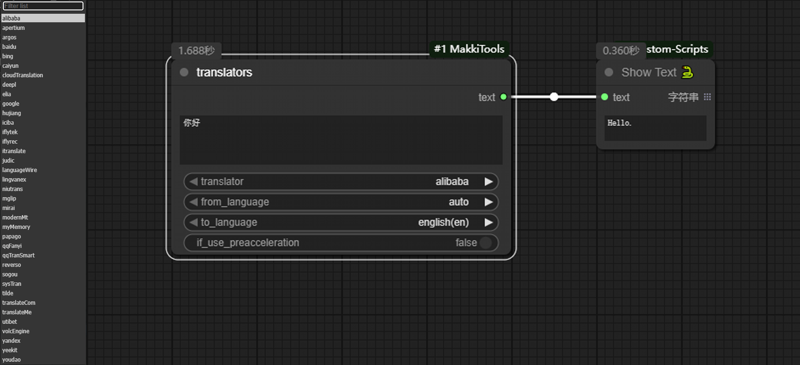

# ComfyUI-MakkiTools

self custom nodes for ComfyUI.

Sometimes I have to create simple nodes when needed, but can't find existing ones. It might just be cases of reinventing the wheel.

---

AutoLoop_create_pseudo_loop_video: Transform un loop video with small variations into loop video(used Alpha trans to connect).

  

Environment_INFO: Display environment information to workflow for easy display of the testing environment when publishing.

translators: [translators](https://github.com/UlionTse/translators) in ComfyUI.

