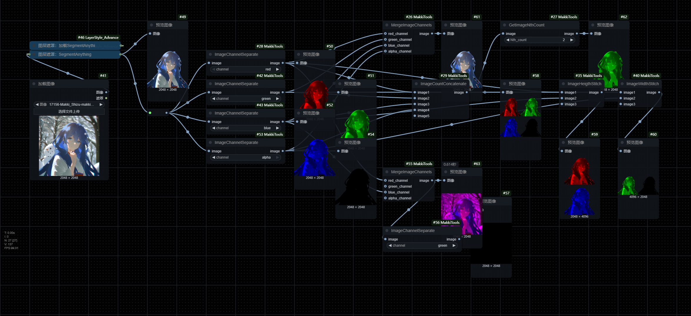
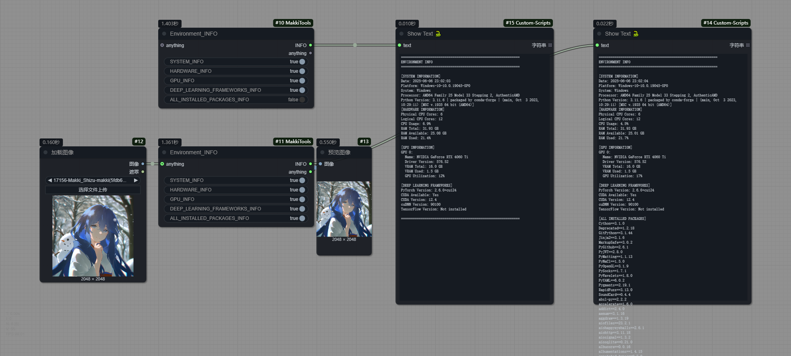
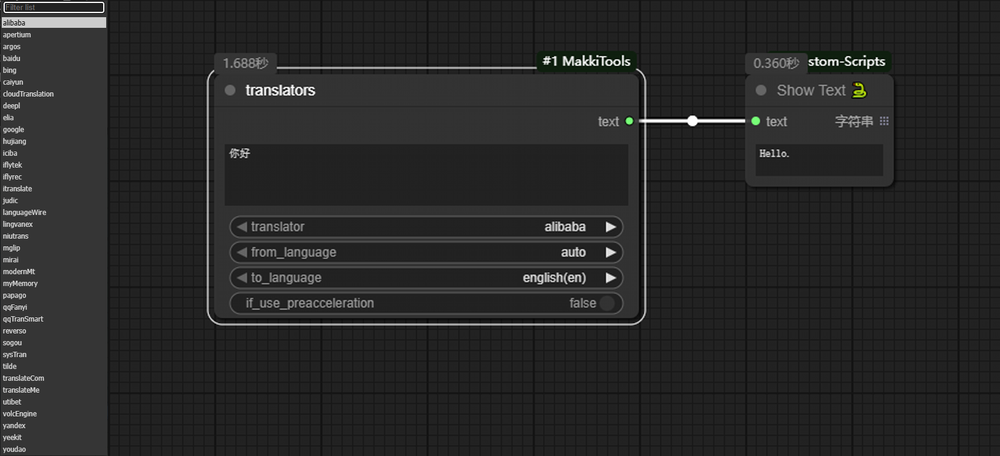
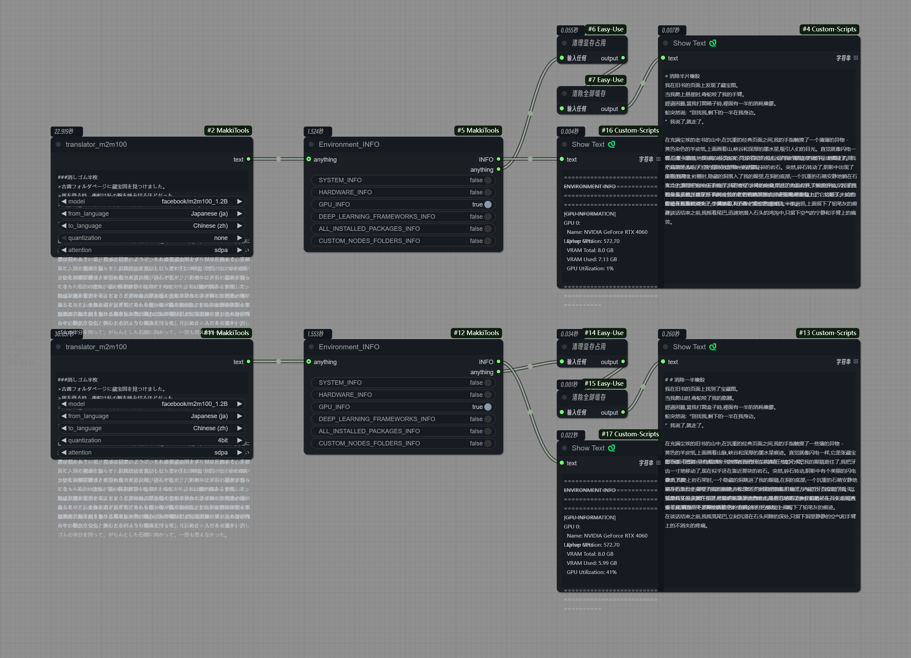

# ComfyUI-MakkiTools

self custom nodes for ComfyUI.

Sometimes I have to create simple nodes when needed, but can't find existing ones. It might just be cases of reinventing the wheel.

# 2025/08/29:Major modification

- **To ensure that future and current nodes do not conflict with other nodes, all node indices have been renamed. If a node is not found, you will need to pull the node again. I'm apologize for the inconvenience.**
- **为确保未来和当前节点不会与其他节点冲突，所有节点索引都已重命名。如果找不到节点，则需要重新拉取该节点。对于给您带来的不便，我深表歉意。**

---

AutoLoop_create_pseudo_loop_video: Transform un loop video with small variations into loop video(used Alpha trans to connect).

  

Environment_INFO: Display environment information to workflow for easy display of the testing environment when publishing.

translators: [translators](https://github.com/UlionTse/translators) in ComfyUI.

translator_m2m100: [m2m_100](https://github.com/pytorch/fairseq/tree/master/examples/m2m_100) in ComfyUI(After downloading the model, it can be used when no network).

